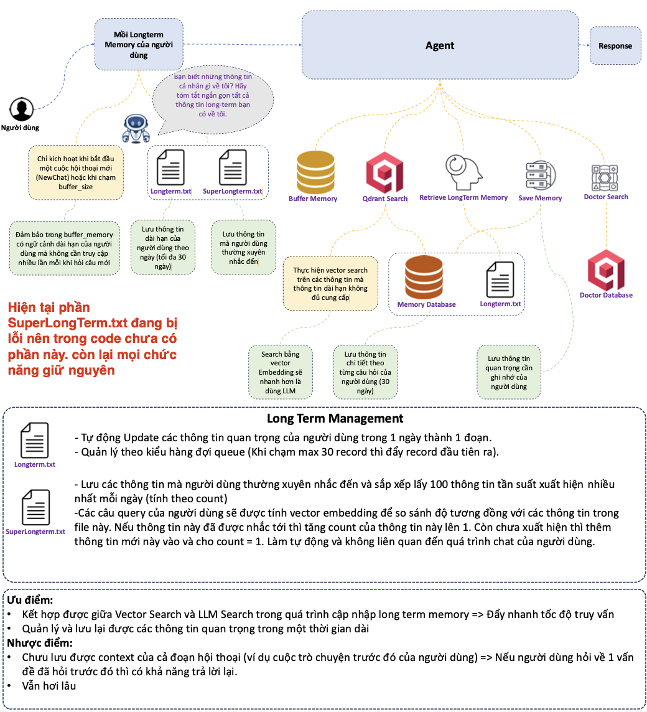
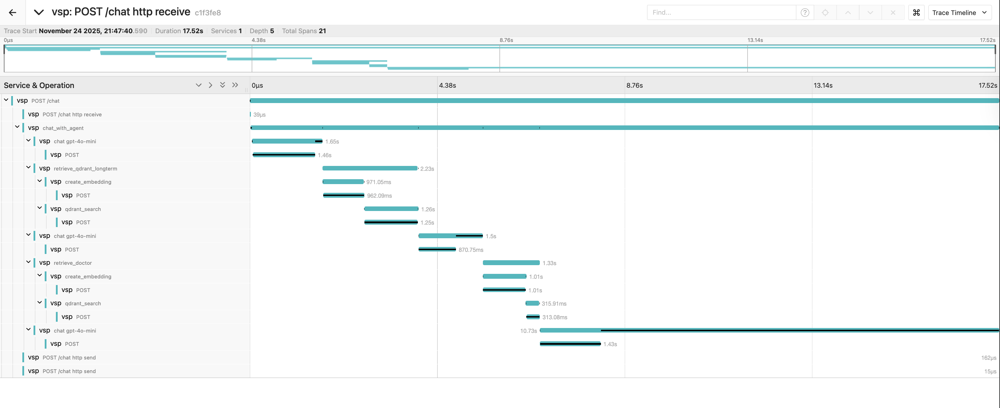
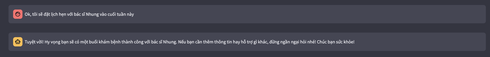
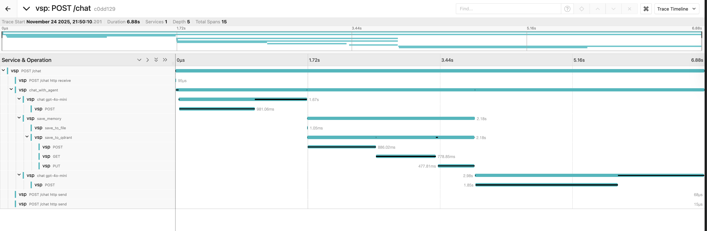
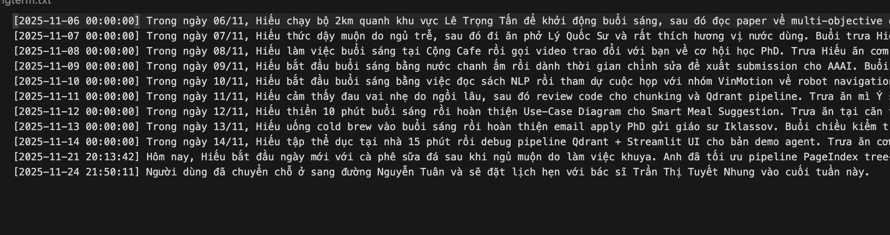

# Doctor Agent with Long-term Memory



## 📋 Hướng dẫn cài đặt và chạy

### Tạo môi trường conda
```bash
conda create -n ai4dev python=3.9
conda activate ai4dev
pip install -r requirements_agent.txt
```

### Khởi động Jaeger
```bash
docker run --rm \    
  -e COLLECTOR_ZIPKIN_HOST_PORT=:9411 \
  -p 16686:16686 \
  -p 4317:4317 \
  -p 4318:4318 \
  -p 9411:9411 \
  jaegertracing/all-in-one:latest
```

### Khởi động API với telemetry
```bash
opentelemetry-instrument --service_name vsf uvicorn api_server:app
```

### Khởi động Streamlit app
```bash
streamlit run streamlit_app.py
```

Truy cập Jaeger UI tại: http://localhost:16686/search để theo dõi trace và log của agent.


### Cập nhật long-term memory
```bash
python update_memory.py
```


## 🎨 UI










